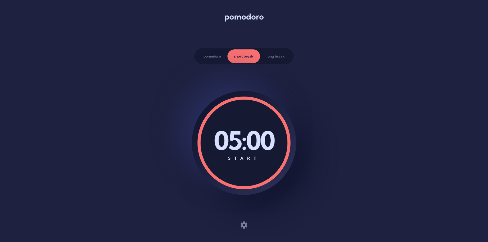

# Frontend Mentor - Pomodoro app solution

This is a solution to the [Pomodoro app challenge on Frontend Mentor](https://www.frontendmentor.io/challenges/pomodoro-app-KBFnycJ6G). Frontend Mentor challenges help you improve your coding skills by building realistic projects.

## Table of contents

- [Overview](#overview)
  - [The challenge](#the-challenge)
  - [Screenshot](#screenshot)
  - [Links](#links)
- [My process](#my-process)
  - [Built with](#built-with)
  - [What I learned](#what-i-learned)
  - [Continued development](#continued-development)
  - [Useful resources](#useful-resources)
- [Author](#author)

## Overview

### The challenge

Users should be able to:

- Set a pomodoro timer and short & long break timers
- Customize how long each timer runs for
- See a circular progress bar that updates every minute and represents how far through their timer they are
- Customize the appearance of the app with the ability to set preferences for colors and fonts

### Screenshot

### Links

- Solution URL: [Frontend Mentor](https://www.frontendmentor.io/solutions/pomodoro-app-using-react-and-tailwind-9bMhabIlhX)
- Live Site URL: [Github Pages](https://mehdi-zibout.github.io/FEM-pomodoro-app/)

## My process

### Built with

- [React](https://reactjs.org/) - JS library
- [Vite](https://vitejs.dev/)
- [Tailwindcss](https://tailwindcss.com/) - For styles
- Flexbox

### What I learned

I learnt that browsers throttle some functions, like `setTimeout` when the tab isn't active. In some browsers like `Firefox Desktop` they set the minimum delay to 1 second, but in others like `Edge` it can be up to a minute or more. and for an app like `Pomodoro` which most of the time will be running in the background, this behavior is very undesriable (because we lose the accuracy of the timer).
I learnt about `document.hidden` condition, which we can use to alter the behavior of the app when the tab is inactive, but this doesn't solve the problem when the browser's added delay is huge (like the `Edge` case.)
so I kept looking for a solution and found Web Workers. according to mdn

> Web Workers are a simple means for web content to run scripts in background threads.
> which is exactly what I needed, and with that my pomodoro app is competely functional.

### Continued development

in the last challenge I wanted to learn how to customize tailwind config, which I did and it saved me a lot of time copying colors and font size in this project. Next I think I'm going to learn css grid and use it for the next challenge. Since everything I built so far was with flexbox, I need to center a div? flexbox. I need a particualr structure? flexbox. I thin

### Useful resources

- [Using Web Workers](https://developer.mozilla.org/en-US/docs/Web/API/Web_Workers_API/Using_web_workers)

## Author

- Website - [Mehdi Zibout](https://www.zryqv.com)
- Frontend Mentor - [@mehdizibout](https://www.frontendmentor.io/profile/yourusername)
